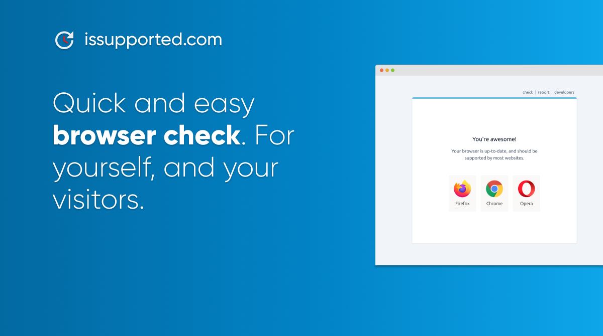

# issupported.com



Check if your browser is still supported by your favorite websites.

# Live Version

See https://issupported.com/

# Embed

issupported.com is created to be embedded on other websites. To add a browser check to yours, simply add a script element right before `</body>`.

For more options, see https://issupported.com/docs

```html
<script
  type="text/javascript"
  src="https://issupported.com/plugin?browsers=defaults, not IE 11"
></script>
```

# Using in Issue Templates

Do you have open source projects, and do you often need browser data from users that create issues in your repo? Point them to https://issupported.com/report, and ask them to copy all info from the gray box.
